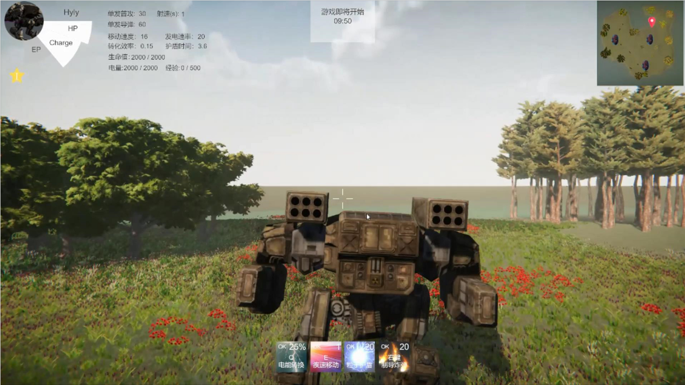

### Hi guys 👋

I'm a post-graduated student major in computer science. In fact, I can design and implement a website with deploying a backend server written in Go, or do some computer vision tasks in Deep Learning. However, my expected career is being an outstanding game server developer, which makes me creative and full of passion, I love it!

#### <星核之心:TheCoreOfStar>

Here is my simple game demo, a MO-FPS game developed by Unity (not completed, what a pity).

or you can download the [demo1](gifs/TheCoreOfStar_Part1.gif) and [demo2](gifs/TheCoreOfStar_Part1.gif).

😄 Coding for fun, coding for a better world!

<!--
**luyu-fan/luyu-fan** is a ✨ _special_ ✨ repository because its `README.md` (this file) appears on your GitHub profile.

Here are some ideas to get you started:

- 🔭 I’m currently working on ...
- 🌱 I’m currently learning ...
- 👯 I’m looking to collaborate on ...
- 🤔 I’m looking for help with ...
- 💬 Ask me about ...
- 📫 How to reach me: ...
- 😄 Pronouns: ...
- ⚡ Fun fact: ...
-->
